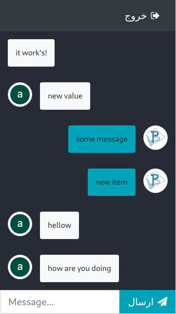

# Chatty dockerized container

The dockerized container for my ****Chatty**** project.

## Preview

### Login


### Chat



## Setup

### Clone Project

you can clone project and the sub project with bellow code.

```bash
git clone --recursive git@gitlab.com:adnanahmady/react-firebase-chat.git
```

### Set Node container git configuration

you can set git configuration for node project.

****Attention****
for getting project to work, you need to at least create an empty `gitconfig` file in the project.

for that you can copy and past bellow code to cli pointing to project.

```bash
cp ./gitconfig.example ./gitconfig
```

or like bellow just create an empty `gitconfig` file in project.

```bash
touch gitconfig
```

